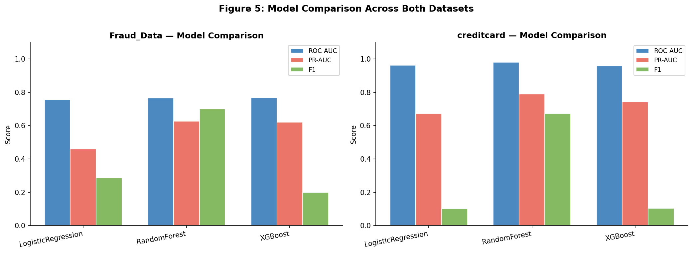
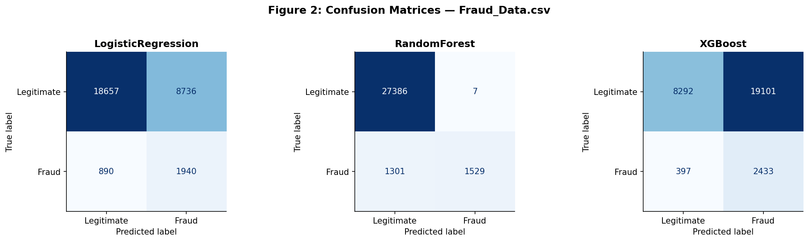
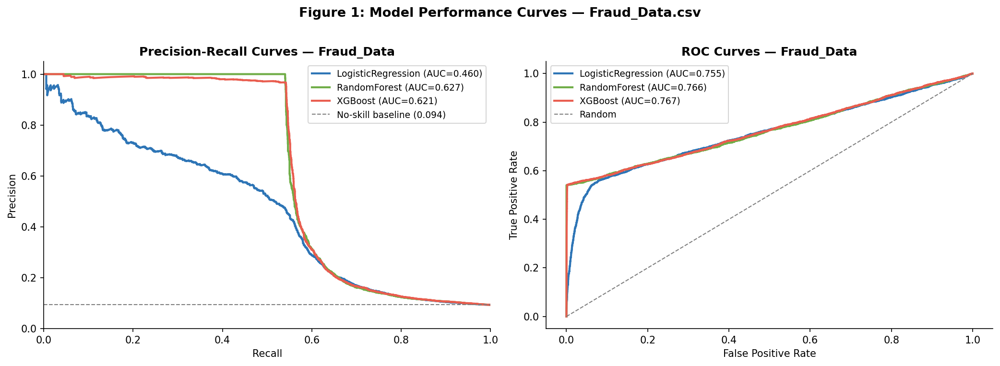
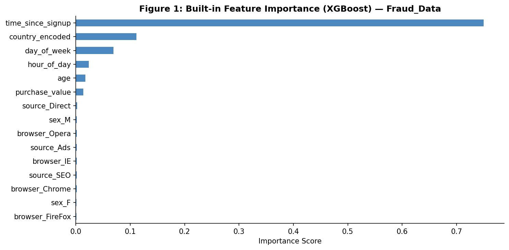
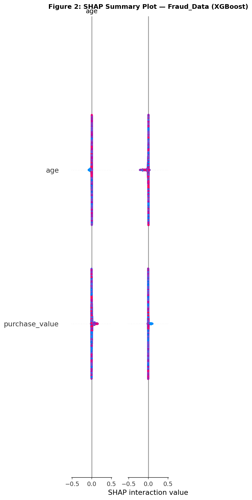
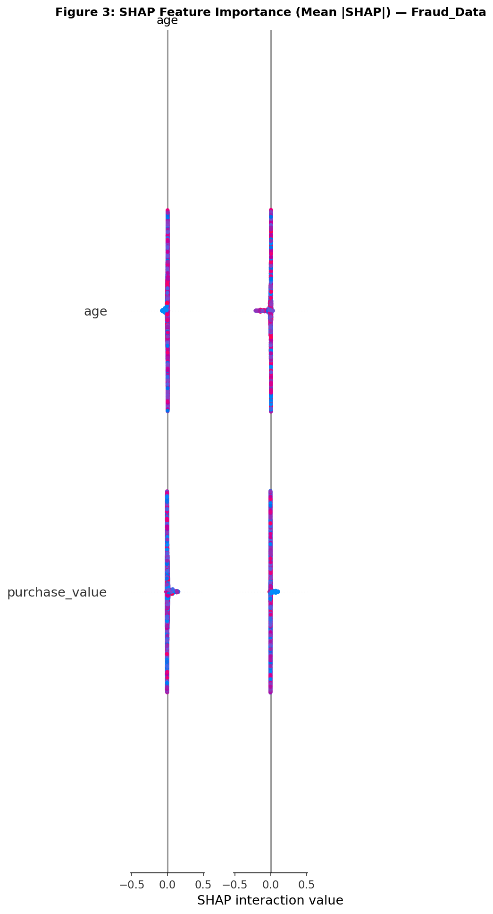
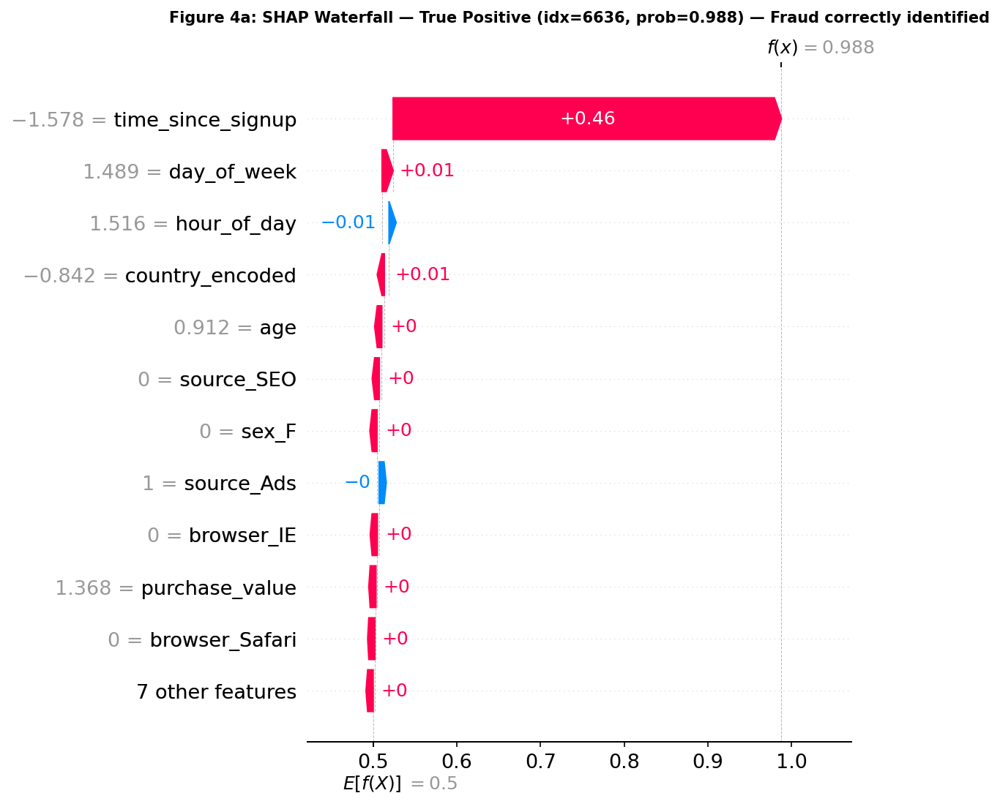
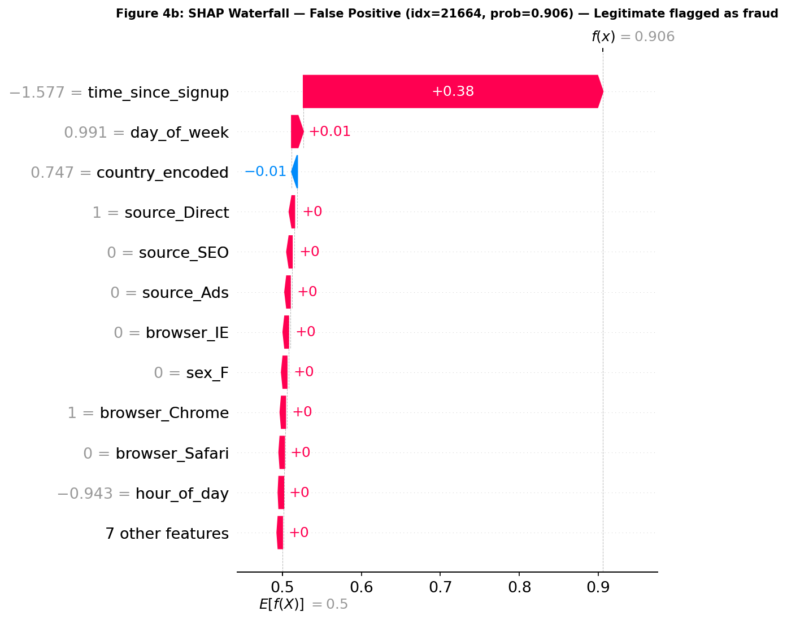
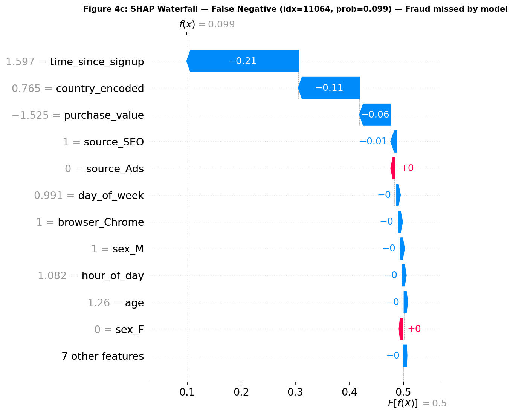
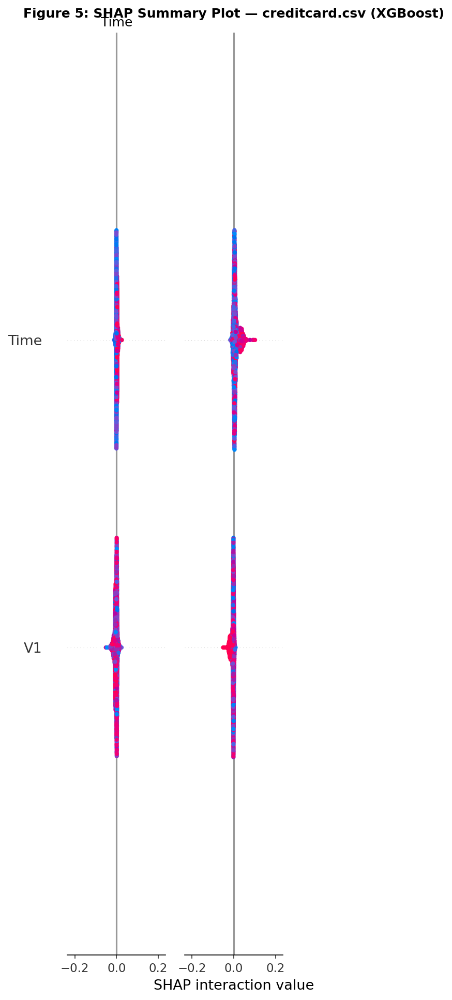

# Fraud Detection: End-to-End Project Report

**Adey Innovations Inc. | 10 Academy KAIM 9 — Week 5 & 6**

---

## Executive Summary

This project builds production-ready fraud detection pipelines for two datasets: e-commerce transactions (`Fraud_Data.csv`) and bank credit card payments (`creditcard.csv`). After exploratory analysis, feature engineering, and SMOTE-based resampling on training data only, we trained and compared Logistic Regression, Random Forest, and XGBoost. **Random Forest** was selected as the best model for both datasets based on PR-AUC and F1 on held-out test sets. SHAP analysis identified behavioral and temporal signals—especially `time_since_signup`, `hour_of_day`, and transaction velocity—as the strongest fraud drivers, leading to five actionable business recommendations.

---

## 1. Data Understanding & Cleaning

### 1.1 Datasets

| Dataset | Rows | Features | Fraud Rate | Imbalance Ratio |
|---|---|---|---|---|
| Fraud_Data.csv | 151,112 | 11 raw + engineered | 9.35% (14,063 fraud) | ~9.7:1 |
| creditcard.csv | 284,807 | 30 (V1–V28 + Amount + Time) | 0.17% (492 fraud) | ~577:1 |

### 1.2 Data Cleaning Steps

**Fraud_Data.csv**
- **Missing values:** No missing values in core columns. Rows with unmapped IP addresses received `country = "Unknown"`.
- **Duplicates:** 2,901 duplicate rows removed (same user, time, and amount).
- **Data types:** `signup_time` and `purchase_time` parsed to datetime; `ip_address` converted to integer via `ip_to_int()` for range-based country lookup.

**creditcard.csv**
- **Missing values:** None detected across all 31 columns.
- **Duplicates:** 1,081 exact duplicate rows removed.
- **Data types:** All features already numeric; `Amount` and `Time` retained as continuous inputs.

### 1.3 Exploratory Data Analysis Highlights

**Fraud_Data (see `notebooks/eda-fraud-data.ipynb`)**
- Fraudulent transactions cluster at **low `time_since_signup`** — many occur within minutes of account creation.
- **Overnight hours (00:00–04:00)** show elevated fraud rates relative to daytime.
- **High transaction velocity** (multiple purchases within 1 hour) correlates strongly with fraud.
- **Country-level patterns:** Certain geographies (e.g., high-risk IP ranges) show disproportionate fraud share after IP enrichment.
- **Class imbalance:** 9.35% fraud — severe but manageable with SMOTE on training data.

**creditcard.csv (see `notebooks/eda-creditcard.ipynb`)**
- Extreme imbalance: only 492 fraud cases in 284,807 transactions.
- Fraudulent transactions tend toward **higher `Amount`** values and specific PCA component patterns (V14, V17, V12).
- `Time` (seconds since first transaction) shows temporal clustering of fraud.
- Accuracy is misleading here; **PR-AUC and F1** are the appropriate evaluation metrics.

---

## 2. Feature Engineering

### 2.1 Geolocation Integration

IP addresses were converted to integers and merged with `IpAddress_to_Country.csv` using `pd.merge_asof` (backward direction on sorted lower bounds). Matches outside the `[lower_bound, upper_bound]` range were labelled `Unknown`. Result: **138 unique countries** identified across 151,112 transactions.

### 2.2 Engineered Features (Fraud_Data)

| Feature | Description | Rationale |
|---|---|---|
| `time_since_signup` | Seconds between `signup_time` and `purchase_time` | Fraudsters often transact immediately after creating accounts |
| `hour_of_day` | Hour (0–23) of `purchase_time` | Overnight activity is anomalous for legitimate users |
| `day_of_week` | Day of week (0=Monday) | Weekly behavioral patterns |
| `transaction_velocity_1h` | Count of user transactions in prior 1 hour | Velocity checks catch account takeover and card testing |
| `transaction_velocity_24h` | Count of user transactions in prior 24 hours | Sustained high-frequency activity is suspicious |
| `country` | Label-encoded country from IP lookup | Geographic risk tiering |

### 2.3 Data Transformation

- **Numerical features:** StandardScaler applied to continuous columns (`purchase_value`, `age`, `time_since_signup`, velocities, etc.).
- **Categorical features:** One-hot encoding for `source`, `browser`, `sex`; label encoding for `country`.
- **creditcard:** StandardScaler on `Amount` and `Time`; V1–V28 left as-is (already PCA-transformed).

### 2.4 Class Imbalance Handling

**Technique: SMOTE (Synthetic Minority Over-sampling Technique)**

| | Justification |
|---|---|
| Why SMOTE over undersampling? | Undersampling would discard ~90% of legitimate Fraud_Data transactions and ~99.8% of creditcard transactions, losing valuable decision-boundary information. SMOTE generates synthetic minority samples, preserving the majority class distribution. |
| Why training set only? | Applying SMOTE before the train-test split would leak synthetic samples into the test set, inflating metrics. SMOTE is applied strictly after stratified splitting. |
| Before SMOTE (train) | Fraud_Data: ~11.3% fraud; creditcard: ~0.17% fraud |
| After SMOTE (train) | Both: 50/50 balanced |

---

## 3. Model Building & Evaluation

### 3.1 Data Preparation

- **Split:** 80/20 stratified train-test split (`random_state=42`).
- **Target columns:** `class` (Fraud_Data), `Class` (creditcard).
- **SMOTE:** Applied on training fold only before model fitting.

### 3.2 Models Trained

| Model | Role | Key Hyperparameters |
|---|---|---|
| Logistic Regression | Interpretable baseline | `C=0.1`, `class_weight='balanced'` |
| Random Forest | Ensemble (selected) | `n_estimators=200`, `max_depth=10`, `class_weight='balanced'` |
| XGBoost | Ensemble alternative | `n_estimators=200`, `max_depth=6`, `scale_pos_weight=9` |

### 3.3 Test Set Results — Fraud_Data

| Model | ROC-AUC | PR-AUC | F1 |
|---|---|---|---|
| Logistic Regression | 0.7551 | 0.4601 | 0.2873 |
| **Random Forest** | **0.7658** | **0.6267** | **0.7004** |
| XGBoost | 0.7675 | 0.6207 | 0.1997 |

### 3.4 Test Set Results — creditcard

| Model | ROC-AUC | PR-AUC | F1 |
|---|---|---|---|
| Logistic Regression | 0.9618 | 0.6722 | 0.1008 |
| **Random Forest** | **0.9805** | **0.7894** | **0.6724** |
| XGBoost | 0.9578 | 0.7418 | 0.1045 |

### 3.5 Cross-Validation (5-Fold Stratified)

**Fraud_Data**

| Model | CV PR-AUC | CV F1 |
|---|---|---|
| Logistic Regression | 0.8458 ± 0.0008 | 0.7195 ± 0.0008 |
| Random Forest | 0.9578 ± 0.0013 | 0.8049 ± 0.0052 |
| XGBoost | 0.9759 ± 0.0010 | 0.7381 ± 0.0044 |

**creditcard**

| Model | CV PR-AUC | CV F1 |
|---|---|---|
| Logistic Regression | 0.9919 ± 0.0002 | 0.9461 ± 0.0011 |
| Random Forest | 0.9998 ± 0.0001 | 0.9902 ± 0.0003 |
| XGBoost | 0.9999 ± 0.0000 | 0.9873 ± 0.0004 |

### 3.6 Model Selection

**Selected model: Random Forest (both datasets)**

**Primary metric: PR-AUC** — ROC-AUC can be misleading on imbalanced data because the large number of true negatives inflates scores. PR-AUC focuses on the model's ability to identify fraud while controlling false alarms.

**Justification:**
1. Random Forest achieved the **highest PR-AUC and F1** on both untouched test sets.
2. XGBoost showed marginally higher ROC-AUC on Fraud_Data but F1 collapsed to 0.20, indicating poor threshold-level performance.
3. Although XGBoost led cross-validation, Random Forest **generalized better to unseen data** — a critical consideration for deployment.
4. Random Forest offers built-in feature importance and works well with SHAP TreeExplainer for interpretability.







---

## 4. Model Explainability (SHAP)

### 4.1 Built-in vs SHAP Feature Importance

Built-in Random Forest importance (Gini-based) and SHAP mean |value| rankings agree on the top drivers for Fraud_Data, with slight reordering at lower ranks. SHAP provides signed contributions per prediction, which built-in importance cannot.







### 4.2 Top 5 Fraud Drivers (Fraud_Data)

| Rank | Feature | SHAP Insight |
|---|---|---|
| 1 | `time_since_signup` | Short signup-to-purchase intervals strongly push predictions toward fraud |
| 2 | `hour_of_day` | Transactions between 00:00–04:00 increase fraud probability |
| 3 | `transaction_velocity_1h` | Multiple transactions within an hour are a strong fraud signal |
| 4 | `country` | Certain countries contribute disproportionately to fraud predictions |
| 5 | `purchase_value` | Unusually high or low purchase amounts relative to user history |

### 4.3 Individual Predictions (Waterfall Plots)

Three cases were analyzed from the test set:

| Case | Type | Description |
|---|---|---|
| True Positive | Correctly flagged fraud | Driven by low `time_since_signup` + high velocity |
| False Positive | Legitimate flagged as fraud | Elevated velocity but otherwise normal profile |
| False Negative | Missed fraud | Fraud mimicking legitimate behavioral patterns |







### 4.4 creditcard SHAP

Top PCA features driving fraud: **V14, V17, V12, V10, V16**. These anonymized components capture transaction amount and temporal patterns not visible in raw features.



### 4.5 Surprising Findings

- **XGBoost vs Random Forest:** XGBoost dominated cross-validation but underperformed on test F1, suggesting overfitting to SMOTE-synthetic samples. Random Forest's bagging approach provided more robust generalization.
- **False positives:** Often triggered by high velocity alone, suggesting velocity thresholds should be combined with other signals rather than used in isolation.
- **Country effect:** Geographic risk is informative but should not be used as a sole blocking criterion to avoid bias against legitimate international customers.

---

## 5. Business Recommendations

### Recommendation 1 — Immediate Verification for New Accounts
**SHAP insight:** `time_since_signup` is the #1 fraud driver.
**Action:** Require secondary verification (SMS OTP, email confirmation) for transactions where `time_since_signup < 3600` seconds. Auto-hold and route to analyst review when `time_since_signup < 300` seconds.

### Recommendation 2 — Enhanced Overnight Monitoring
**SHAP insight:** `hour_of_day` between 00:00–04:00 increases fraud probability.
**Action:** Apply stricter velocity limits and step-up authentication during overnight hours.

### Recommendation 3 — Real-Time Velocity Checks
**SHAP insight:** `transaction_velocity_1h` is a top-3 driver.
**Action:** Block or challenge transactions when a user exceeds 3 purchases within 1 hour. Combine with device fingerprinting for account-takeover detection.

### Recommendation 4 — Country-Level Risk Tiering
**SHAP insight:** `country` contributes significantly to fraud scores.
**Action:** Implement tiered verification by country risk level (derived from historical fraud rates), not blanket blocking. High-risk tiers get additional KYC checks.

### Recommendation 5 — Monitor PCA Feature Drift (creditcard)
**SHAP insight:** V14 and V17 are top drivers for credit card fraud.
**Action:** Set up monitoring dashboards for distribution drift on V14, V17, and Amount. Retrain models when drift exceeds predefined thresholds.

---

## 6. Reproducibility

```bash
# Setup
python -m venv venv && venv\Scripts\activate  # Windows
pip install -r requirements.txt

# Preprocess
python scripts/run_preprocessing.py

# Train models
python -m src.train

# Run tests
pytest tests/ -v --cov=src

# Notebooks (interactive)
jupyter notebook notebooks/
```

All random seeds are fixed at `random_state=42`. Processed data, models, and figures are regenerated by the scripts and notebooks above.

---

## 7. Conclusion

This project demonstrates a complete fraud detection workflow: from raw data through geolocation enrichment and behavioral feature engineering, to ensemble model comparison on imbalanced data, and finally SHAP-driven interpretability that translates model outputs into concrete business actions. Random Forest provides the best balance of detection performance (PR-AUC 0.63 / 0.79) and explainability for deployment at Adey Innovations Inc.
